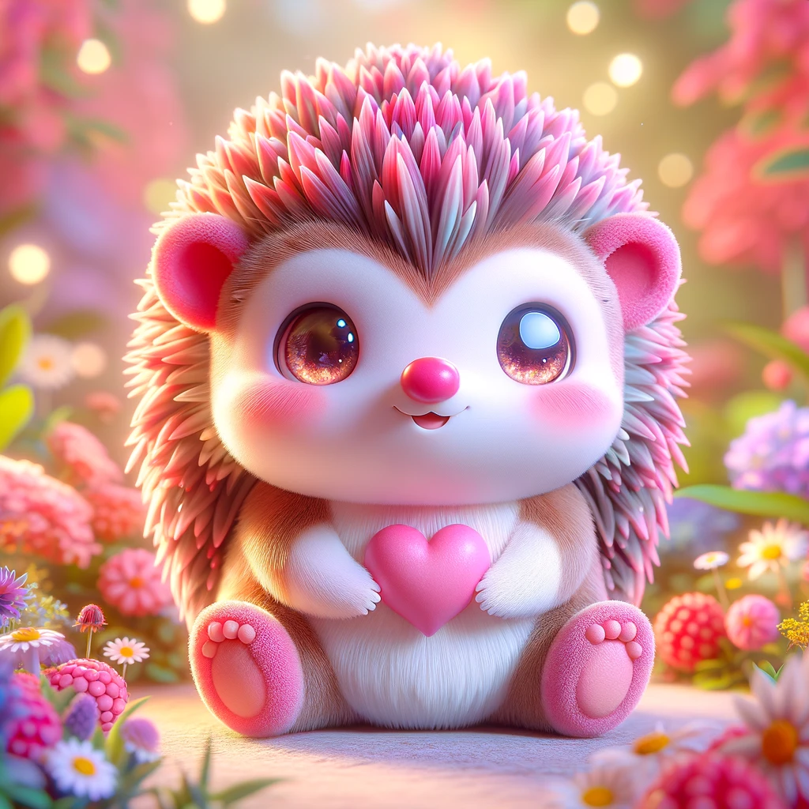

<!-- Improved compatibility of back to top link: See: https://github.com/othneildrew/Best-README-Template/pull/73 -->
<a name="readme-top"></a>
<!--
*** Thanks for checking out the Best-README-Template. If you have a suggestion
*** that would make this better, please fork the repo and create a pull request
*** or simply open an issue with the tag "enhancement".
*** Don't forget to give the project a star!
*** Thanks again! Now go create something AMAZING! :D
-->


<!-- PROJECT SHIELDS -->
<!--
*** I'm using markdown "reference style" links for readability.
*** Reference links are enclosed in brackets [ ] instead of parentheses ( ).
*** See the bottom of this document for the declaration of the reference variables
*** for contributors-url, forks-url, etc. This is an optional, concise syntax you may use.
*** https://www.markdownguide.org/basic-syntax/#reference-style-links
-->


[![Forks][forks-shield]][forks-url]
[![Stargazers][stars-shield]][stars-url]
[![Issues][issues-shield]][issues-url]
[![MIT License][license-shield]][license-url]
[![LinkedIn][linkedin-shield]][linkedin-url]


<!-- PROJECT LOGO -->
<br />
<div align="center">
  <a href="https://github.com/senabibi/Fantane">
    
  </a>
  <h3 align="center">Fantane</h3>
  <p align="center">
    Fantane is a captivating interactive platform meticulously crafted through the art of prompt engineering. This innovative website serves as a haven for enthusiasts of mystical beings, offering them an immersive experience in the enchanting realm of magical creatures. Seamlessly developed with a blend of HTML, CSS, JavaScript, and Bootstrap, Fantane provides users with an engaging space to delve into the wondrous world of fantastical entities.

With Fantane, users embark on an enthralling journey where they can not only discover a diverse array of magical creatures but also actively participate in evaluating and expressing their admiration for these fantastical beings. Through intuitive interfaces and captivating visuals, users are invited to explore the myriad features and endearing qualities that define each creature.

One of Fantane's standout features is its comprehensive rating and review system, empowering users to assess and share their thoughts on the characteristics and charm of each magical creature. Whether it's the ethereal glow of a shimmering sprite or the mischievous twinkle in the eyes of a playful pixie, users have the opportunity to articulate their fascination and appreciation.

Furthermore, Fantane fosters a sense of community by facilitating discussions and interactions among users. Through the integrated commenting system, users can engage in lively conversations, share insights, and exchange anecdotes about their favorite magical beings. This collaborative environment not only enhances the user experience but also cultivates a vibrant community of fantasy enthusiasts.

In essence, Fantane transcends the conventional boundaries of a mere website, offering a portal to a realm where imagination knows no limits. It embodies the essence of prompt engineering by seamlessly blending technology with creativity to evoke a sense of wonder and fascination. Whether you're a seasoned fantasy aficionado or a curious explorer, Fantane promises an enchanting adventure filled with discovery, interaction, and endless magic.
   
 <br />
    <a href="https://github.com/senabibi/Fantane"><strong>View More »</strong></a>
    <br />
    <br />
    <a href="https://github.com/senabibi/Fantane">View Demo</a>
    ·
    <a href="https://github.com/senabibi/Fantane/issues">Report Bug</a>
    ·
    <a href="https://github.com/senabibi/Fantane/issues">Request Feature</a>
  </p>
</div>
<!-- Add more sections as needed -->

<!-- TABLE OF CONTENTS -->
<details>
  <summary>Table of Contents</summary>
  <ol>
    <li>
      <a href="#about-the-project">About The Project</a>
      <ul>
        <li><a href="#built-with">Built With</a></li>
      </ul>
    </li>
    <li>
      <a href="#getting-started">Getting Started</a>
      <ul>
        <li><a href="#prerequisites">Prerequisites</a></li>
        <li><a href="#installation">Installation</a></li>
      </ul>
    </li>
    <li><a href="#usage">Usage</a></li>
    <li><a href="#roadmap">Roadmap</a></li>
    <li><a href="#contributing">Contributing</a></li>
    <li><a href="#license">License</a></li>
    <li><a href="#contact">Contact</a></li>
    <li><a href="#acknowledgments">Acknowledgments</a></li>
  </ol>
</details>


<!-- ABOUT THE PROJECT -->
## About The Project

[![Product Name Screen Shot][product-screenshot]](http://127.0.0.1:5500/index.html)
Fantane is an immersive web platform designed for exploring and interacting with magical creatures. Developed using HTML, CSS, JavaScript, and Bootstrap, this project offers users a captivating experience where they can discover, rate, and review various mystical beings.

The primary goal of Fantane is to provide users with an engaging space to delve into the enchanting world of magical creatures, compare their unique features, and share their thoughts and opinions. With intuitive interfaces and visually stunning designs, Fantane aims to spark the imagination and curiosity of users, inviting them to embark on an enthralling journey through the realm of fantasy.

Key features of the Fantane project include:

Interactive exploration of a diverse range of magical creatures.
Rating and reviewing system for evaluating creature characteristics and cuteness.
Seamless comparison of creature features to aid users in their exploration.
User-friendly interface enhanced with Bootstrap for a smooth and intuitive experience.
Community engagement through commenting and discussion functionalities.
Integration of prompt engineering techniques to ensure a seamless user experience.
Fantane is not just a website; it's a portal to a world where magic and imagination converge. Whether you're a seasoned fantasy enthusiast or a curious explorer, Fantane promises an enchanting adventure filled with discovery, interaction, and endless wonder.

<p align="right">(<a href="#readme-top">back to top</a>)</p>

### Built With

This section should list any major frameworks/libraries used to bootstrap your project. Leave any add-ons/plugins for the acknowledgements section. 

* [HTML](https://developer.mozilla.org/en-US/docs/Web/HTML) - Standard markup language for creating web pages.
* [CSS](https://developer.mozilla.org/en-US/docs/Web/CSS) -  Style sheet language used for presenting the website's layout and appearance.
* [JS](https://developer.mozilla.org/en-US/docs/Web/JavaScript) - Programming language responsible for adding interactivity and dynamic content.
* [Bootstrap](https://getbootstrap.com/) - Front-end framework used for designing responsive and mobile-first websites.

* [Global AI Hub](https://globalaihub.com/) - Platform and resources for AI education and projects.
* [Brave Browser](https://brave.com/) - Web browser used during development and testing.


<p align="right">(<a href="#readme-top">back to top</a>)</p>


## Getting Started

Fantane is an interactive website where users can explore and interact with various magical creatures. To get started, follow these steps:

## Prerequisites
Before diving into Fantane, ensure you have the following prerequisites:

Basic knowledge of HTML, CSS, JavaScript, and Bootstrap.
A code editor like Visual Studio Code for editing and viewing the project files.

## Creatures and Images
In the creatures folder, you'll find images of the magical creatures corresponding to their IDs. For example, 1.png corresponds to the creature with ID 1, 2.png to ID 2, and so on.
### Prompts
<!-- Displaying Creature Image -->
<div align="center">
  
</div>

<!-- Prompt for Creature Information -->
<p align="center">Fluffy is a gentle creature that brings comfort to those around it with its soft fur and soothing presence.</p>

<br>
<!-- Displaying Creature Image and Prompt -->
<div align="center">
  
  <p>Whiskers is a curious critter that explores its surroundings with its whiskers, always eager to discover new things.</p>
</div>
<br>
<!-- Displaying Creature Image and Prompt -->
<div align="center">
  
  <p>Bubbles is a cheerful character that spreads joy wherever it goes, leaving a trail of bubbles that brings smiles to everyone's faces.</p>
</div>
<br>
<!-- Displaying Creature Image and Prompt -->
<div align="center">
  
  <p>Snuggles is a lovable companion that enjoys cuddling with friends and spreading warmth with its gentle presence.</p>
</div>

<br>
<!-- Displaying Creature Image and Prompt -->
<div align="center">
  
  <p>Paws is an energetic critter that loves to play and explore, using its oversized paws to leap and bound through its surroundings.</p>
</div>

<title>Magic Creatures</title>
<style>
  table {
    width: 100%;
    border-collapse: collapse;
  }
  th, td {
    border: 1px solid black;
    padding: 8px;
    text-align: left;
  }
  th {
    background-color: #f2f2f2;
  }
</style>
</head>
<body>

<h2>Magic Creatures</h2>

<table>
  <tr>
    <th>Name</th>
    <th>Element</th>
    <th>Appearance</th>
    <th>Personality</th>
    <th>Abilities</th>
    <th>Story</th>
  </tr>
  <tr>
    <td>Fluffy</td>
    <td>Pastel</td>
    <td>Small, fluffy with big round eyes</td>
    <td>Cuddly, soft, tiny wings on its back</td>
    <td>Can create a calming aura around it</td>
    <td>Fluffy is a gentle creature that brings comfort to those around it with its soft fur and soothing presence.</td>
  </tr>
  <tr>
    <td>Whiskers</td>
    <td>Gray</td>
    <td>Chubby with long whiskers</td>
    <td>Chubby, long tail that curls at the end</td>
    <td>Can sense vibrations in the ground</td>
    <td>Whiskers is a curious critter that explores its surroundings with its whiskers, always eager to discover new things.</td>
  </tr>
  <tr>
    <td>Bubbles</td>
    <td>Blue</td>
    <td>Bright blue with large expressive eyes</td>
    <td>Bubbly, constant trail of bubbles floating around</td>
    <td>Can manipulate bubbles for various purposes</td>
    <td>Bubbles is a cheerful character that spreads joy wherever it goes, leaving a trail of bubbles that brings smiles to everyone's faces.</td>
  </tr>
  <tr>
    <td>Snuggles</td>
    <td>White</td>
    <td>Cuddly with heart-shaped nose</td>
    <td>Soft, cuddly, long floppy ears</td>
    <td>Can emit a warm, comforting aura</td>
    <td>Snuggles is a lovable companion that enjoys cuddling with friends and spreading warmth with its gentle presence.</td>
  </tr>
  <tr>
    <td>Paws</td>
    <td>Multicolor</td>
    <td>Playful with oversized paws</td>
    <td>Playful, mischievous glint in its eyes</td>
    <td>Enhanced agility and speed</td>
    <td>Paws is an energetic critter that loves to play and explore, using its oversized paws to leap and bound through its surroundings.</td>
  </tr>
  <tr>
    <td>Sunny</td>
    <td>Yellow</td>
    <td>Bright yellow with radiant smile</td>
    <td>Radiant, sunny disposition</td>
    <td>Can harness the power of sunlight</td>
    <td>Sunny is a cheerful character that brightens up even the gloomiest of days, spreading warmth and happiness wherever it goes.</td>
  </tr>
  <tr>
    <td>Glimmer</td>
    <td>Shimmering</td>
    <td>Covered in shimmering scales with iridescent wings</td>
    <td>Shimmering, sparkling wings</td>
    <td>Can manipulate light and create illusions</td>
    <td>Glimmer is a magical being that enchants others with its shimmering appearance and dazzling displays of light.</td>
  </tr>
  <tr>
    <td>Cotton</td>
    <td>White</td>
    <td>Fluffy as a cloud with sky-blue eyes</td>
    <td>Pure white, gentle demeanor</td>
    <td>Can create soft clouds for resting on</td>
    <td>Cotton is a gentle soul that floats through the sky like a fluffy cloud, bringing comfort and tranquility wherever it goes.</td>
  </tr>
  <tr>
    <td>Pebbles</td>
    <td>Speckled</td>
    <td>Speckled pattern resembling pebbles</td>
    <td>Playful bounce, twinkle in its eye</td>
    <td>Can blend into its surroundings</td>
    <td>Pebbles is an adventurous character that enjoys hopping from place to place, its speckled fur camouflaging it in its environment.</td>
  </tr>
  <tr>
    <td>Frost</td>
    <td>Icy blue</td>
    <td>Adorned in icy blue fur and sparkling crystals</td>
    <td>Leaves a trail of frosty mist</td>
    <td>Can lower temperatures and create ice structures</td>
    <td>Frost is a chilly presence that brings a touch of frost wherever it goes, its sparkling crystals reflecting the light like a winter wonderland.</td>
  </tr>
  <tr>
    <td>Twirl</td>
    <td>Pastel</td>
    <td>Fur a blend of pastel hues with colorful ribbons</td>
    <td>Twirls its tail to leave a trail of colorful ribbons</td>
    <td>Can manipulate ribbons for various purposes</td>
    <td>Twirl is a whimsical character that dances through the air, leaving behind a trail of colorful ribbons that flutter and dance in the breeze.</td>
  </tr>
  <tr>
    <td>Doodle</td>
    <td>Colorful</td>
    <td>Covered in doodles and scribbles with changing fur</td>
    <td>Changes color with mood, leaves a trail of glitter</td>
    <td>Can bring doodles to life and manipulate art supplies</td>
    <td>Doodle is a creative creature that brings imagination to life, leaving behind a trail of sparkling doodles and vibrant colors.</td>
  </tr>
  <tr>
    <td>Scooter</td>
    <td>Yellow</td>
    <td>Streak of bright yellow fur with sparks behind it</td>
    <td>Fast as lightning</td>
    <td>Enhanced speed and agility</td>
    <td>Scooter is a speedster that zooms around with lightning-fast agility, leaving behind a trail of sparks that crackle and fizz with energy.</td>
  </tr>
  <tr>
    <td>Puddle</td>
    <td>Water</td>
    <td>Made of water droplets with shimmering colors</td>
    <td>Shimmers with iridescent colors</td>
    <td>Can manipulate water and create rainbows</td>
    <td>Puddle is a watery wonder that flows gracefully, leaving behind a trail of shimmering droplets that dance and sparkle in the sunlight.</td>
</tr>
<tr>
    <td>Zigzag</td>
    <td>Energetic</td>
    <td>Swirling patterns on fur with lightning bolt tail</td>
    <td>Full of energy and excitement</td>
    <td>Can generate electrical charges and control lightning</td>
    <td>Zigzag is a dynamic character that zips around with electrifying speed, leaving behind a trail of crackling energy and swirling patterns.</td>
</tr>
<tr>
    <td>Scribbles</td>
    <td>Colorful</td>
    <td>Covered in colorful scribbles with expressive eyes</td>
    <td>Expressive eyes, constant whirlwind of crayons</td>
    <td>Can bring drawings to life and manipulate art supplies</td>
    <td>Scribbles is an artistic soul that brings creativity to life, leaving behind a whirlwind of color and imagination wherever it goes.</td>
</tr>
<tr>
    <td>Starlight</td>
    <td>Twinkling</td>
    <td>Twinkling coat like the night sky</td>
    <td>Leaves a trail of stardust, eyes shine like galaxies</td>
    <td>Can manipulate starlight and create illusions</td>
    <td>Starlight is a celestial being that glimmers and shines like the night sky, leaving behind a trail of stardust that twinkles and sparkles in its wake.</td>
</tr>
<tr>
    <td>Wiggle</td>
    <td>Patchwork</td>
    <td>Fur resembles a patchwork quilt, wiggles its tail</td>
    <td>Wiggles its tail excitedly, leaves a trail of confetti</td>
    <td>Can manipulate fabric and create playful illusions</td>
    <td>Wiggle is a playful character that wiggles and dances with joy, leaving behind a trail of colorful confetti that fills the air with fun and excitement.</td>
</tr>
<tr>
    <td>Sizzle</td>
    <td>Fiery</td>
    <td>Fiery red fur with flickering flames on its tail</td>
    <td>Warm to the touch, leaves a trail of glowing embers</td>
    <td>Can manipulate fire and generate heat</td>
    <td>Sizzle is a warm and comforting presence that radiates heat and light, leaving behind a trail of glowing embers that flicker and dance in its wake.</td>
</tr>
<tr>
    <td>Blossom</td>
    <td>Floral</td>
    <td>Covered in blooming flowers with sweet floral scent</td>
    <td>Sweet floral scent, leaves a trail of petals</td>
    <td>Can manipulate flowers and induce growth</td>
    <td>Blossom is a fragrant delight that spreads the aroma of flowers wherever it goes, leaving behind a trail of petals that bloom in its wake.</td>
</tr>
<tr>
    <td>Sprinkle</td>
    <td>Sweet</td>
    <td>Coat resembles colorful candies, leaves sugary trail</td>
    <td>Leaves a trail of sugary sweetness</td>
    <td>Can manipulate sugar and create confectionery illusions</td>
    <td>Sprinkle is a sweet character that leaves behind a trail of sugary sweetness, spreading joy and delight wherever it goes.</td>
</tr>
</table>

</body>
</html>


### Installation

1. Clone the repository
   ```sh
   git clone https://github.com/senabibi/LibraryManagementSystem.git

### Installation

_Below are the instructions for installing and setting up your library management system. Please make sure to follow each step carefully._
<!-- Installation Instructions -->

1. Clone the repository
   ```sh
   git clone https://github.com/senabibi/Fantane.git
   cd Fantane


2. Ensure you have the necessary tools and libraries installed for a complete development environment:

  HTML
  CSS
  JavaScript
  Bootstrap
  You can include Bootstrap by adding the following link to your HTML file:

 ```
  <link href="https://stackpath.bootstrapcdn.com/bootstrap/4.5.2/css/bootstrap.min.css" rel="stylesheet">
```
<p align="right">(<a href="#readme-top">back to top</a>)</p>


<!-- USAGE EXAMPLES -->
## Usage

Fantane offers a delightful experience for exploring the enchanting world of magical creatures and engaging with fellow enthusiasts. Here's how you can make the most of it:

1. **Discover Magical Creatures:**
   - Start your journey by browsing through the images of magical creatures showcased on the homepage. Each image represents a unique creature waiting to be explored.

2. **Learn About Creature Details:**
   - Click on the image of any creature that catches your interest. This action will lead you to a detailed page dedicated to that creature, where you can delve into its characteristics, powers, and captivating backstory.

3. **Leave Your Feedback:**
   - After reading about a creature, take a moment to share your thoughts. Use the comment section provided on the creature's detail page to express your opinions, ask questions, or simply engage in discussions with other users.

4. **Express Your Appreciation:**
   - If you find a creature particularly charming or intriguing, show your admiration by clicking the "Like" button. Your likes contribute to the overall rating of the creature and help others discover the most beloved creatures within the Fantane community.

5. **Engage with the Community:**
   - Explore the comments left by other users to gain new insights, discover hidden details about creatures, or even make new friends who share your fascination with magical beings.

6. **Personalize Your Experience:**
   - As you navigate through Fantane, feel free to add creatures to your favorites list by clicking the corresponding button on their detail pages. This feature allows you to curate a collection of your most beloved creatures for easy access and future reference.

7. **Spread the Magic:**
   - Enjoying your time on Fantane? Don't hesitate to spread the magic by sharing your favorite creatures and the Fantane platform with your friends and social circles. Let others join in on the enchantment and discover the wonders of the magical realm.

Embark on a captivating journey through Fantane, where every creature has a story to tell and every interaction brings new enchantment into your life.

<p align="right">(<a href="#readme-top">back to top</a>)</p>


<!-- ROADMAP -->
## Roadmap

- [x] Add Changelog
- [x] Add back to top links
- [ ] Add Additional Templates w/ Examples
- [ ] Add "components" document to easily copy & paste sections of the readme

See the [open issues](https://github.com/senabibi/Fantane/issues) for a full list of proposed features (and known issues).

<p align="right">(<a href="#readme-top">back to top</a>)</p>


<!-- LICENSE -->
## License

Distributed under the MIT License. See [LICENSE](https://github.com/senabibi/Fantane/blob/main/LICENSE) for more information.

Copyright (c) 2024 Sena Bi

Permission is hereby granted, free of charge, to any person obtaining a copy
of this software and associated documentation files (the "Software"), to deal
in the Software without restriction, including without limitation the rights
to use, copy, modify, merge, publish, distribute, sublicense, and/or sell
copies of the Software, and to permit persons to whom the Software is
furnished to do so, subject to the following conditions:

The above copyright notice and this permission notice shall be included in all
copies or substantial portions of the Software.

THE SOFTWARE IS PROVIDED "AS IS", WITHOUT WARRANTY OF ANY KIND, EXPRESS OR
IMPLIED, INCLUDING BUT NOT LIMITED TO THE WARRANTIES OF MERCHANTABILITY,
FITNESS FOR A PARTICULAR PURPOSE AND NONINFRINGEMENT. IN NO EVENT SHALL THE
AUTHORS OR COPYRIGHT HOLDERS BE LIABLE FOR ANY CLAIM, DAMAGES OR OTHER
LIABILITY, WHETHER IN AN ACTION OF CONTRACT, TORT OR OTHERWISE, ARISING FROM,
OUT OF OR IN CONNECTION WITH THE SOFTWARE OR THE USE OR OTHER DEALINGS IN THE
SOFTWARE.

<p align="right">(<a href="#readme-top">back to top</a>)</p>


<!-- CONTACT -->
## Contact

Your Name - [@senabibi](https://www.linkedin.com/in/nursena-bitirgen-5743341b9/) - bitirgensena@gmail.com

Project Link: [https://github.com/senabibi/LibraryManagementSysyem](https://github.com/senabibi/Fantane/tree/master)

<p align="right">(<a href="#readme-top">back to top</a>)</p>


<!-- ACKNOWLEDGMENTS -->
## Acknowledgments

Use this space to list resources you find helpful and would like to give credit to. I've included a few of my favorites to kick things off!

* [Choose an Open Source License](https://choosealicense.com)
* [GitHub Emoji Cheat Sheet](https://www.webpagefx.com/tools/emoji-cheat-sheet)
* [Malven's Flexbox Cheatsheet](https://flexbox.malven.co/)
* [Malven's Grid Cheatsheet](https://grid.malven.co/)
* [Img Shields](https://shields.io)
* [GitHub Pages](https://pages.github.com)
* [Font Awesome](https://fontawesome.com)
* [React Icons](https://react-icons.github.io/react-icons/search)

<p align="right">(<a href="#readme-top">back to top</a>)</p>


<!-- MARKDOWN LINKS & IMAGES -->
<!-- https://www.markdownguide.org/basic-syntax/#reference-style-links -->

[forks-shield]: https://img.shields.io/github/forks/senabibi/Fantane.svg?style=for-the-badge
[forks-url]: https://github.com/senabibi/Fantane/network/members

[stars-shield]: https://img.shields.io/github/stars/senabibi/Fantane.svg?style=for-the-badge
[stars-url]: https://github.com/senabibi/Fantane/stargazers

[issues-shield]: https://img.shields.io/github/issues/senabibi/Fantane.svg?style=for-the-badge
[issues-url]: https://github.com/senabibi/Fantane/issues

[license-shield]: https://img.shields.io/github/license/senabibi/Fantane.svg?style=for-the-badge
[license-url]: https://github.com/senabibi/Fantane/blob/main/LICENSE

[linkedin-shield]: https://img.shields.io/badge/-LinkedIn-black.svg?style=for-the-badge&logo=linkedin&colorB=555
[linkedin-url]: https://www.linkedin.com/in/nursena-bitirgen-5743341b9/
